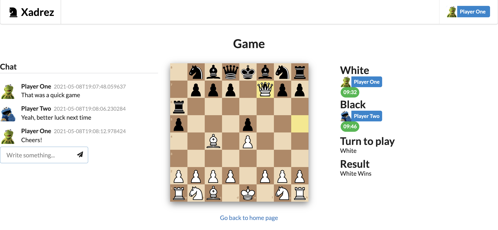

# Xadrez

Simple chess application written in Python using Auth0, AWS API Gateway, Lambda and DynamoDB.

## Motivation

This project is part of the Udacity Cloud Developer program, where we have to apply some of the concepts learned throughout the course.

I took this opportunity to build a chess game because despite its apperant simplicity it can bring very interesting design choices and exercise many aspects of the application design, development, testing and deployment. It goes without saying that I'm also a huge fan, although a terrible player!

This is not supposed to be a production ready application, but good enough such that it can be easy to play and develop.

There's always space for improvement, which I'll be doing over time, such as adding more tests.

Why AWS? It is the only cloud provider lectured in the course, so naturally this work follows that same provider.

Why Serverless? It seemed interesting to built an application with a more functional architecture where the state lies entirely on the database, idealy would have used actor/model with Elixir, but time didn't permit.

Why Auth0? It was an easy way to use a third party application for managing the authentication/authorization logic, most of the client side was already well documented with working examples.

Why Python? Easy to get started, but would have liked to try with Go or Elixir.

Why React? Good boilerplate projects, Easy to develop, Great libraries for websockets and manage state such as redux and sagas, not to mention many other great libraries.

Why DynamoDB? Was really easy to get started, initially wanted to use MongoDB, but the support wasn't straigtforward, best solution was probably provided from MongoDB Atlas, but for simpler deployment, decided to keep every resource under AWS.


## Features

* Authentication with Auth0
* Simple chess match with unlimited or predefined times of 1/5/10 minutes
* Choose starting color
* Resign game
* Real-time experience using WebSockets
* Highlight possible moves
* In game chat room

## Dependencies

* Auth0
* Amazon AWS
* Python 3.x
* Serverless Framework

## Setup

### Install Python 3

This application was developed on Python 3.7, so this is the recommended version (see [installation instructions](https://www.python.org/downloads/)).

### Install Yarn

See the [installation guide](https://yarnpkg.com/lang/en/docs/install/#debian-stable)

### Install Serverless Framework

See the [installation guide](https://serverless.com/framework/docs/providers/aws/guide/installation/).

### AWS CLI

In order to deploy your lambda functions and the website, serverless will require your AWS account credentials.
To achieve this, you can setup your AWS CLI on your local machine (see the [official documetation](https://docs.aws.amazon.com/polly/latest/dg/setup-aws-cli.html)).

### Auth0 Account

1. Create an account on Auth0 (free tier)
2. Create a [regular web application](https://auth0.com/docs/dashboard/guides/applications/register-app-regular-web)
3. Copy your domain and Client ID for later use

### Backend

1. Go into the backend folder
2. Export your Auth0 settings

```
$ export AUTH0_DOMAIN=<Your Auth0 Domain>
$ export AUTH0_CLIENT_ID=<Your Auth0 Client ID>
```

3. Deploy your lambda functions to AWS

```
$ make install
$ make deploy
```

4. Save the Gateway API endpoints for both HTTP and WSS endpoints.

### Frontend

1. Go into the frontend folder
2. Using the information gathered from Auth0 and backend deployments, you should create the `.env` file, as shown in the following example:

```
# Auth0
REACT_APP_AUTH0_DOMAIN = 'my-app-domain.auth0.com'
REACT_APP_AUTH0_CLIENT_ID = 'my-client-id'
# AWS
REACT_APP_API_URL = 'https://234sdfds.execute-api.us-east-1.amazonaws.com/dev'
REACT_APP_WS_URL = 'wss://sadfasd3d.execute-api.us-east-1.amazonaws.com/dev'
REACT_APP_WEBSITE_URL = 'http://mywebsite'
```

3. Deploy the frontend

```
$ make build
$ make deploy
```

4. Once the deployment is done, you should receive an endpoint to where your website will be served, use that URL and add it to your your allowed Callback and Logout URLs settings in Auth0 (see Applications > settings).
5. You should now be all setup! Enjoy!

## Run it locally

### Auth0 Account

You can reuse the same tenant, otherwise [create a separate one](https://auth0.com/docs/dev-lifecycle/setting-up-env).

### Backend

1. Go into the backend folder
2. Export your Auth0 settings

```
$ export AUTH0_DOMAIN_ID=<Your Auth0 Domain ID>
$ export AUTH0_CLIENT_ID="<Your Auth0 Client ID>
```

3. Start the API Gateway with both HTTP and Websocket endpoints in offline mode:

```
$ make install
$ virtualenv -p /usr/bin/python3.7 venv
$ source venv/bin/activate
$ pip install -r requirements.txt
$ make dev
```

4. Start the DynamoDB in offline mode:

`$ make dynamodb-offline`

### Frontend

1. Go into the frontend folder
2. Using the information gathered from Auth0 and backend deployments, you should create the `.env.development` file, as shown in the following example:

```
# Auth0
REACT_APP_AUTH0_DOMAIN = 'my-app-domain.auth0.com'
REACT_APP_AUTH0_CLIENT_ID = 'my-client-id'
# AWS
REACT_APP_API_URL = 'http://localhost:5000/dev'
REACT_APP_WS_URL = 'ws://localhost:3001'
REACT_APP_WEBSITE_URL = 'http://localhost:3000'
```

3. Setup a dev application on Auth0 using the following URLs:

```
Allowed Callback URLs: http://localhost:3000/callback
Allowed Logout URLs: http://localhost:3000
```

4. Run your frontend locally

```
$ make build
$ make dev
```

It will be listening on http://localhost:3000

5. You should now be all setup! Enjoy

## Gameplay image



## Improvements

* Add python type hints
* Add docstrings
* Test frontend
* Test backend
* Support Game Stats
* Join game as spectator
